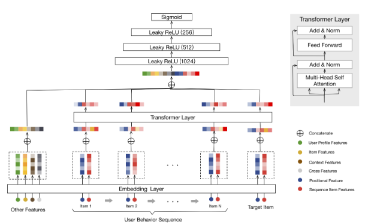

# Behavior Sequence Transformer for Movie Recommendation

## Introduction

This repository is to implement the behavior sequence transformer model proposed by Alibaba, which can be found in this paper: https://arxiv.org/abs/1905.06874
and is to leverages this sequential behaviour of the users in watching and rating movies, as well as user profile and movie features, to predict the rating of the user to a target movie.

## Dataset
We use the 1M version of the Movielens dataset. The dataset includes around 1 million ratings from 6000 users on 4000 movies, along with some user features, movie genres. In addition, the timestamp of each user-movie rating is provided, which allows creating sequences of movie ratings for each user, as expected by the BST model.

## Results
We train all user ratings and leave the latest rating as a label. Compared to  other impletementations, we achieve the best result below:

| Implementation |  MAE  | Sequence Length |
| :------ | :---: | ---: |
|  :rocket:[My Pytorch Implementation](https://github.com/Nelsonlin0321/ml-behavior-sequence-transformer-for-movie-recommendation)    | 0.687  | 4 |
| [Offical Keras Implemenation ](https://keras.io/examples/structured_data/movielens_recommendations_transformers/)   | 0.761  | 4 |
|  :rocket:[My Pytorch Implementation](https://github.com/Nelsonlin0321/ml-behavior-sequence-transformer-for-movie-recommendation)    | 0.649 | 10 |
| [Other Pytorch Implementation](https://github.com/jiwidi/Behavior-Sequence-Transformer-Pytorch)    | 0.74  | 10 |

## Experiments on Sequence Length

| Sequence Length |  MAE  | Batch Size |
| :------ | :---: | ---: |
| 4     |  0.6870  |128|
| 10    | 0.6487  | 64|
| 15    | 0.6751 | 32|
| 20    | 0.6716  |32|

## To Reproduce the Result 

You can run it in colab [here](https://colab.research.google.com/drive/1jpzsW0R74cVwyCHgG4A4cG2_fajmb8bI) or notebook `A_Behavior_Sequence_Transformer_For_Movie_Recommendation.ipynb` locally to repreoduce the result or `A_Behavior_Sequence_Transformer_For_Movie_Recommendation(W&B).ipynb` to track the metrics on Weights & Baises.